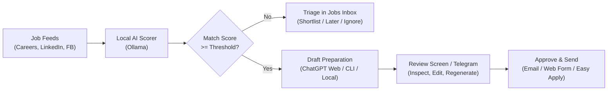

# Job Radar

> **"Recruiters are using AI to filter candidates. Let us use AI to filter employers."**

For years, recruiting teams have deployed automated ATS parsers, AI keyword scrapers, and algorithmic screening bots to filter candidate resumes before a human ever looks at them. Candidates spend hours tailoring applications, writing cover letters, and parsing dense corporate job descriptions, only to be rejected by an automated filter in thirty seconds.

**Job Radar flips the script.**

Job Radar turns your Mac into your personal, autonomous recruiting radar. It monitors job boards, LinkedIn searches, Facebook groups, and company career portals around the clock. It runs local AI models to strip away corporate buzzwords, ruthlessly checks hard eligibility constraints, evaluates qualitative fit against your verified experience, and prepares fully tailored resumes and application packages for your review.

Everything runs on your Mac. Your profile, credentials, sessions, and data stay on your machine. And most importantly: **nothing is ever sent without your explicit review and one-click authorization.**

---

**Platform:** macOS · **Local address:** [http://127.0.0.1:8787](http://127.0.0.1:8787) · **Core rule:** Applications are submitted only when you choose **Approve & send** in Job Radar or approve a draft via Telegram.

---

## Key Capabilities

- **Autonomous Multi-Source Sourcing:** Continuously scans 43+ direct company career portals, LinkedIn job search feeds, and curated Facebook recruiting groups every 4 hours.
- **Local AI Match Scoring:** Uses a local Ollama model to evaluate real role fit, required/preferred skills, experience depth, and work mode without leaking your data to third parties.
- **Hard Constraints & Intent Filtering:** Filter by seniority levels, role families, preferred/excluded employers, salary minimums, negative keywords, and location constraints (e.g., Hanoi only or Remote).
- **Evidence-Grounded Resume Tailoring:** Connect your GitHub to inspect public repositories, generate verified project contribution cards, and selectively map proven results to matching vacancies.
- **Flexible AI Drafting Engine:**
  - **ChatGPT Web:** Automated browser handoff through your authenticated Chrome profile—Job Radar fills the prompt, sends the message, **automatically receives the generated answer**, and updates the resume PDF preview.
  - **CLI Engines:** Non-interactive, scriptable drafting through **Codex CLI**, **Antigravity CLI** (`agy`), or **Claude Code CLI** (`claude`).
  - **Local OSS Inference:** Fully offline drafting using Codex OSS paired with local **Ollama** models.
  - **Deterministic Local Templates:** Fast, template-based drafting without any AI model calls.
- **Granular Section Regeneration:** Regenerate only the sections that need work—summary, experience bullets, selected projects, skills, education, or email cover message.
- **Universal Application Dispatch:**
  - Direct employer email applications via SMTP (with tailored PDF attachments).
  - External ATS web forms with multi-step field inspection and auto-population.
  - LinkedIn Easy Apply discovery and form step validation.
- **Telegram Mobile Review:** Receive review packets with the tailored PDF directly on your phone, with instant **Approve & send**, **Edit**, and **Regenerate** inline buttons.
- **Recruiting Pipeline Tracking:** Track decision stages (Shortlisted, Later, Ignored) and interview outcomes (Interview, Offer, Rejected) across all applications.

---

## Installation

### Requirements
- **OS:** macOS (Apple Silicon or Intel).
- **Dependencies:** Google Chrome (for LinkedIn/Facebook scans and ChatGPT Web), Internet connection.
- The installer automatically manages `uv`, `Tectonic` (for LaTeX resume rendering), and `Ollama` (for local matching models).

### 1-Line Setup
From a clone of this repository, run:

```sh
./install.sh
```

If you do not have the repository yet:

```sh
git clone git@github.com:longnt27/jobradar.git
cd jobradar
./install.sh
```

The installer will:
1. Install `uv`, `Tectonic`, and `Ollama` if missing.
2. Install locked Python dependencies and Playwright Chromium.
3. Register a persistent macOS background service that starts on login.
4. Launch Job Radar and open [http://127.0.0.1:8787](http://127.0.0.1:8787) in your browser.

> [!NOTE]
> The app runs locally on your Mac; `127.0.0.1:8787` is a local loopback server, not an external hosted website.

---

## Setup Guide

Open **My profile** and complete the setup steps:

### 1. Set Up AI Models
- **Local Matching Model:** Choose an installed Ollama model (e.g., `qwen2.5:7b` or `llama3.2`) to evaluate qualitative job fit and extract vacancy requirements locally. You can download recommended models directly from the UI.
- **Drafting Provider:** Choose how your resumes and cover messages will be written:
  - **ChatGPT Web:** Connects directly to [chatgpt.com](https://chatgpt.com) using your saved Chrome browser profile. Click **Log in to ChatGPT** to sign in once. Job Radar enters the prompt, waits for ChatGPT to generate the response, receives the answer, and applies it to your draft automatically.
  - **Codex CLI / Antigravity CLI / Claude Code CLI:** Fast terminal CLI tools running on your Mac.
  - **Codex OSS + Ollama:** 100% private local drafting on your machine.
  - **Local template:** Deterministic drafting without LLM inference.

### 2. Import Your Resume
- Upload an existing text-based PDF or paste LaTeX source code.
- Review and refine **Personal details** (contact information, education, skills) and **Work history** (roles, dates, and LaTeX item bullet points).

### 3. Add Verified GitHub Projects
- In **My profile → GitHub projects**, enter your GitHub username or paste a repository link.
- Let your chosen provider inspect repository files and commit history to draft an evidence brief with measurable achievements, technical contributions, and tech stacks.
- Review and click **Approve**. Only approved project cards are eligible to be woven into your tailored resume bullets.

### 4. Connect Job Sources
- **Company Career Feeds:** 43 high-signal company career portals ([CAREER_FEEDS.md](CAREER_FEEDS.md)) are preconfigured and scanned every 4 hours.
- **LinkedIn & Facebook:** Click **Sign in to LinkedIn** or **Sign in to Facebook** in Profile. Job Radar opens a dedicated Chrome session for you to sign in once, preserves authentication cookies, and reuses the session for automated background scans.
- Paste additional Facebook group URLs or custom career page URLs in **Job sources** anytime.

### 5. Connect Review Channels (Optional)
- **Telegram Bot:** Create a bot via [@BotFather](https://t.me/BotFather), enter your token, and click **Find my chat ID**. When a job qualifies for an application, Telegram receives a review message with the exact compiled PDF resume and action buttons.
- **Email (SMTP):** If sending email applications, configure your SMTP server (e.g., Gmail using an App Password). Click **Send test email** to verify delivery.

---

## Day-to-Day Workflow



### 1. Triaging the Jobs Feed
- Navigate to **Jobs** to see all detected vacancies with live match scores, role fit summaries, detected salaries, and freshness indicators.
- **Search Intent & Constraints:** Set custom preferences under Search Intent (role families, maximum years of experience, Hanoi or Remote preferences, negative keywords). Postings violating hard rules receive an instant score of 0.
- **Quick Decisions:** Triage jobs with **Shortlist**, **Save for later** (snoozes for 7 days), or **Ignore**.

### 2. Preparing and Reviewing Applications
- **Automatic Draft Preparation:** Turn on **Auto-apply** with a score threshold (e.g. 80+). When a strong match appears, Job Radar selects the top matching projects, writes targeted bullet points, translates Vietnamese postings to appropriate email messages, and renders the PDF resume.
- **Manual Preparation:** Click **Prepare application** on any job at any time.

### 3. Reviewing, Inspecting, and Regenerating
Open any draft under **Applications**:
- **Resume Preview:** Inspect the rendered PDF page-by-page. Click **Edit resume details** to tweak LaTeX lines directly with instant PDF re-rendering.
- **Regenerate Sections:** Use the **Regenerate** tab to rewrite only what needs improvement (`summary`, `experience`, `projects`, `skills`, `message`, or `all`).
  - When using **ChatGPT Web**, clicking **Enter prompt in ChatGPT** opens ChatGPT, sends your context and instructions, streams the response, and **automatically receives and applies the answer** back to the draft and PDF!
- **Inspect Form:** For web applications or LinkedIn Easy Apply, click **Inspect form** to discover all required inputs, attachments, and questions before submitting.

### 4. Authorizing Submission
- Review destination, package fingerprint, and blockers.
- Click **Approve & send** (or tap Approve on Telegram).
- Job Radar sends the email via SMTP or automates form submission in the background, logging verified receipts and confirmation screenshots.
- Track outcomes as **Interview**, **Offer**, or **Rejected** in the submission history.

---

## Service Management & CLI Commands

The background service automatically runs in the background. Manage it from the repository checkout:

| Action | Command |
| --- | --- |
| Update repository and restart service | `./install.sh` |
| Restart background service | `.venv/bin/job-radar install-service` |
| Stop and remove macOS background service | `.venv/bin/job-radar uninstall-service` |
| Run app in foreground (debug / logs) | `.venv/bin/job-radar serve` |
| Run test suite | `.venv/bin/pytest -v` |

### Data Storage & Paths
All data is stored locally in `~/Library/Application Support/JobRadar`:
- `job_radar.db`: SQLite database holding vacancies, drafts, and submissions.
- `browser_profile/`: Dedicated Google Chrome profile for social and ChatGPT sessions.
- `artifacts/`: Compiled LaTeX resume PDFs and submission receipts.
- `service.log` / `service.stderr.log`: Background runner logs.

To customize directories or ports:
```sh
JOB_RADAR_PORT=9000 JOB_RADAR_DATA_DIR=~/Documents/JobRadar ./install.sh
```

---

## Troubleshooting

| Issue | Resolution |
| --- | --- |
| **Interface does not open** | Check `~/Library/Application Support/JobRadar/service.stderr.log` or run `.venv/bin/job-radar serve` in the terminal to inspect errors. |
| **Jobs stuck on "Analyzing"** | Ensure Ollama is running (`ollama serve`) and the matching model selected in **My profile** is downloaded. |
| **ChatGPT Web sign-in required** | In **My profile → Set up AI models**, select ChatGPT Web and click **Log in to ChatGPT** to sign in to your OpenAI account in Chrome. |
| **LinkedIn / Facebook session expired** | Open **My profile → Connect LinkedIn and Facebook** and sign in again in the opened Chrome window. |
| **Gmail rejects SMTP login** | Enable 2-Step Verification on your Google account and generate an **App Password**. Normal account passwords will be rejected by Google. |
| **Form submission blocked** | Click **Inspect form** on the application review screen and fill any missing required fields or custom questions. |

---

## Privacy & Security

- **Local-First Architecture:** Job Radar binds to `127.0.0.1`. It has no tracking, telemetry, or external cloud backend.
- **Strict Human-in-the-Loop:** Automated processes stop at the draft review stage. Submission requires explicit authorization.
- **Credential Storage:** Bot tokens, SMTP passwords, and browser cookies are stored on your local disk with standard user permissions.
- **Repository Safety:** Repository inspection inspects files and commit history statically; it never executes third-party code.

---

## References

- [Direct Career Feeds Catalog](CAREER_FEEDS.md)
- [Employer Directory & Scope](EMPLOYER_SCOPE.md)
- [ChatGPT Web Browser Integration](job_radar/chatgpt_handoff.py)
- [Local Job Analysis & Scoring](job_radar/local_analysis.py)
- [Web Application & API](job_radar/web.py)
